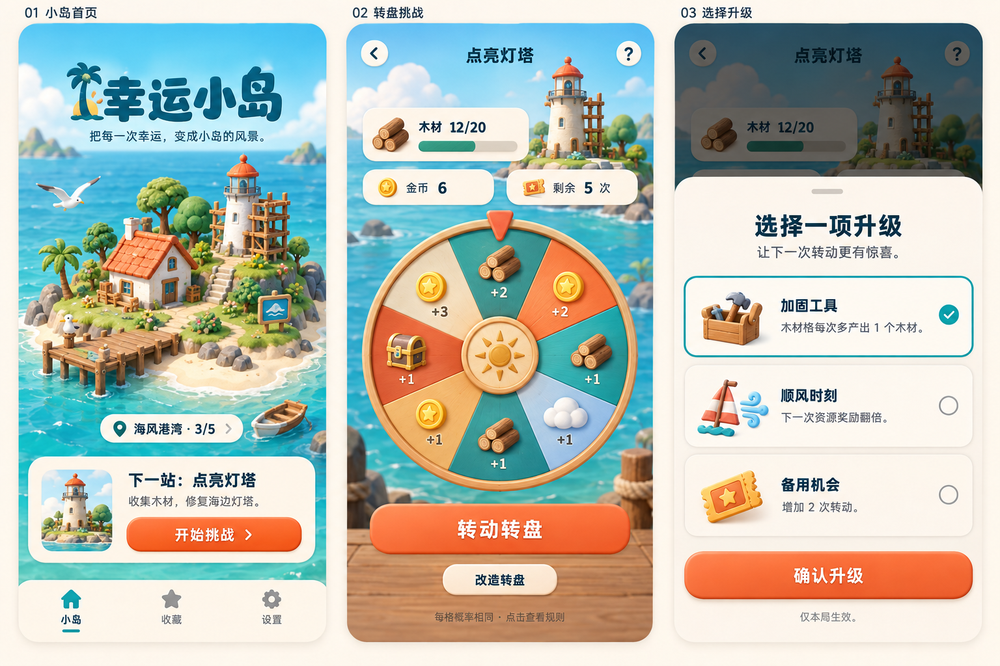

# 幸运小岛 · 原型说明

版本：V1.0｜日期：2026-09-16｜用途：产品评审与原生实现参考

## 1. 视觉原型

[打开三屏视觉稿](prototypes/lucky-island-visual-v1.png)

- 左：小岛首页。立体插画、区域进度、灯塔任务与底部导航。
- 中：转盘对局。木材目标、金币、剩余次数、8 格转盘与改造入口。
- 右：三选一升级。工具增益、双倍资源、增加次数。

图像使用内置 imagegen 生成，属于高保真风格概念稿。正式素材需要拆分制作；不以图中文字、示例数值或绘制细节代替产品规则。图中 12/20 木材、6 金币和5次剩余是对局中状态，不是开局配置。

## 2. 可交互原型

[打开独立 HTML](prototypes/lucky-island-interactive-v1.html)

用浏览器打开上述文件，可直接点击操作。独立版已导出，不依赖原会话文件路径。[可编辑片段源文件](prototypes/lucky-island-source-v1.html)单独保存。

体验路径：开始挑战 → 转动 → 升级 → 花金币改造 → 成功或失败结算 → 回岛查看收藏。设置可开启快速转动，方便评审。

已包含：随机结果、资源更新、8格转盘动画、3种升级、金币强化、规则说明、局内返回继续、成功后灯塔收藏、重试。

## 3. 与正式产品的区别

| 当前原型 | 正式产品计划 |
|---|---|
| 一个灯塔关卡 | 多区域、多关卡 |
| CSS 简化场景和 emoji 图标 | 分层正式美术和统一图标 |
| 仅内存状态，刷新清空 | 本地持久化与中断恢复 |
| 快速转动开关 | 音效、触感、动画及辅助功能设置 |
| 金币增强木材格 | 完整改造规则，格子替换待细化 |
| 收藏中部分初始建筑为示例 | 真实进度驱动收藏 |
| 无音频或触感实现 | 原生声音与触感反馈 |

这不是已经完成的 iOS 应用，也不代表最终数值平衡或上架完成。

## 4. 评审核验要点

- 首页是否突出小岛成果与下一目标。
- 游戏页是否能立即看懂目标、剩余次数和资源。
- 转动节奏、结果展示和升级频率是否舒适。
- 三个升级的效果是否容易理解，是否愿意尝试不同组合。
- 原生开发时是否保持视觉稿的暖色玩具质感。

## 5. 验证记录与限制

源文件 JavaScript 已做语法检查；本轮导出检查文件结构、依赖和资源完整性。此前自动浏览器验证受到本地文件 URL 安全策略阻止，未完成真实浏览器端到端操作验证，因此不将原型标为已完整测试。

导出壳包含通用预览运行时，核心界面、逻辑和样式内联。无需后端。浏览器字体和 emoji 的外观可能因平台不同而变化。
